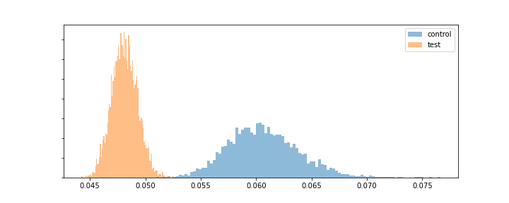
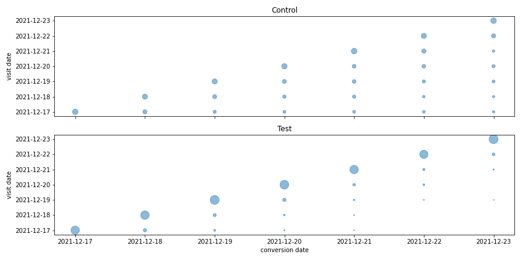

## Testing conversion rate improvements

Many internet companies use A/B testing to evaluate the performance of website changes they
want to make. A typical metric in such scenarios is the conversion rate (CVR) of a user, i.e\. the probability
that a user converts (e.g\. makes a purchase) on the website.
A typical A/B test setup in such a situation would randomize users into to (equally sized) groups:
the test group that would be exposed to the new experience and the control group that would
be exposed to the status quo version of the website.

An analyst would do a power calculation based on the expected effect size from the test,
the variation of the CVR metric, the desired type I and type II error bounds in order to
determine the duration of the test.
After the test the analyst might perform [Fisher\'s exact test](https://en.wikipedia.org/wiki/Fisher%27s_exact_test)
to determine whether or not to accept the new website version. 

### Larry\'s analysis
Let us consider the following fictitious example
in which Larry the analyst of the internet company Nozama runs a 1-week-long A/B test.
His data shows the following 

|             | control | test |
|-------------|---------|------|
| users       | 35000    | 35000 |
| conversions | 1394     | 1666   |

Larry uses python to compute the p-value of the Fisher exact statistic

```python
from scipy import stats

data = [[1394, 1666], [35000 - 1394, 35000 - 1666]]
pval = stats.fisher_exact(data)[1]
print(pval)
``` 

The result is `5.365752694746135e-07` which is \"statistically significant\" w.r.t. to Larry\'s predefined 5%
significance level.

Larry can\'t believe it, the new version improved the user conversion by 19.5%! 

**But has it really ?**

Larry just blindly applied some statistical test to his data without thinking about the data
generating process.

*So what exactly are the assumptions that Larry implicitly used in his analysis ?*

For the Fisher exact test we need to assume that we have independent, identically distributed conversion events. More
precisely, we need to assume that (for each group) $ Conversions \sim Bin(users, p) $ for some probability $p$, i.e. that
the number of conversions in each group are drawn from a Binomial distribution with $n=$number of users and some fixed
probability $p$ (the conversion rate).

### A smarter approach
Using domain knowledge about how people on the website behave we know users that land on the website don\'t all
necessarily convert on the same day but sometimes purchase with some time lag after the initial visit. With this
knowledge at hand we take a new (Bayesian) approach to analysing the test results.

We make the following model assumptions:

\begin{itemize}
\item $p$ = probability of conversion
\item $X$ = lag in days between user website visit and conversion, where $X=\infty$ corresponds to no conversion
\item Conditional on a conversion, we assume that the lag variable $X$ is distributed according to a zero-inflated
geometric distribution. In formulas:
$$P(X=k) = (1-p)\cdot \bold{1}_{\{k=\infty\}}
+ p\cdot (\pi\cdot \bold{1}_{\{k=0\}} + (1-\pi)\cdot\lambda \cdot(1-\lambda)^k\cdot \bold{1}_{\{k\geq 0\}})$$
\end{itemize}

We then can write the cdf of $X$ as follows (for $k<\infty$)
$$
F(k) = P(X \leq k) = 
p(1 -(1-\pi)(1-\lambda)^{k+1}).
$$

Before we can fit the model to our data there is one more problem that we encounter. Users in our data set for which we
didn\'t observe a conversion could either be *truly* non-converting or we haven\'t been able to observe their conversion
*yet*, since we are only considering 1 week of data. Users that entered our experiment on the first day for which we
haven\'t observed a conversion will have a smaller probability to still convert since we know that they didn\'t do a
purchase in one of the following 6 days. On other other hand, users that entered our experiment on the 7th day will have
a relatively larger probability to still convert on one of the following days.
We are faced with a so called [censored data problem](https://en.wikipedia.org/wiki/Censoring_(statistics)).

A subsample of our data looks as follows:

| visit_date   | conversion_date   |   users     |   is_control |
|:-------------|:------------------|------------:|-------------:|
| 2021-12-01   | 2021-12-01        |          84 |            1 |
| 2021-12-01   | None              |        4750 |            1 |
| 2021-12-02   | 2021-12-04        |          33 |            1 |
| 2021-12-02   | None              |        4785 |            1 |
| 2021-12-01   | 2021-12-05        |           2 |            0 |
| 2021-12-01   | None              |        4756 |            0 |
| 2021-12-02   | 2021-12-02        |         199 |            0 |
| 2021-12-02   | None              |        4762 |            0 |

We can write a Stan program in order to fit a model on the test and control data separately. We use Stan\'s custom
distribution functions capability (see [here](https://link.springer.com/article/10.3758/s13428-016-0746-9) for a
tutorial) to code the pmf, cdf, inverse cdf and ccdf of our model as follows:

```stan
functions{
    real uncensored_lpmf(int y, real pi, real p, real lambda){
        if (y == 0) 
            return log(p) + log(pi + (1 - pi) * lambda);
        else
            return log(p) + log(1 - pi) + log(lambda) + y * log(1 - lambda);
        }

    real censoredccdf(real y, real pi, real p, real lambda){
        return log(1 - p + p * (1 - pi) * pow(1 - lambda, y + 1));
        }
        
     real invcdf(real u, real pi, real p, real lambda){
         if (u > p)
             return -1;
         else
             return ceil(log( (p - u) / (p * (1 - pi)) ) / log(1 - lambda) - 1);
     }
    
     real uncensored_rng(real pi, real p, real lambda) {
         real u;
         u = uniform_rng(0, 1);
         return invcdf(u, pi, p, lambda);
     }
}
```
Because we know that the typical conversion rate of our website is around 5% and unlikely to be larger than 10% we put a
$Beta(2, 38)$-prior on the $p$-parameter. 
We also know that there are disproportionally many users that convert on the day of their first visit which is why we
assume a non-negative value of $\pi$ but with slightly more weight towards $0$ which leads us to specify the prior
$\pi\sim Beta(1,2)$. Finally, we put a non-informative uniform prior on the \"success\"-probability $\lambda$.
Note, that values $\max\{-1, \frac{-(1-\lambda)}{\lambda}\} \leq \pi < 1$ would still give a well-defined model,
and would allow for a zero-*deflated* geometric distribution as well.


You can find our complete Stan model [here](https://github.com/volkale/convpybayes/blob/main/stan/disconvpy.stan).

Fitting the model to the data above we obtain the following posterior distributions for $p$ for the test and control
groups, respectively.



As we can clearly see from the plot we are almost 100% certain (given the model and the data) that our control version
has a higher conversion rate $p$ than the new test variant. So we should definitively not accept the new website
variant.

**How is this possible ?**

By inspecting all the posterior parameters of the model (not just the conversion rate $p$) we see that the new website
increased the parameters $\pi$ and $\lambda$ of our zero-inflated geometric distribution of the time-to-conversion
(aka lag) variable $X$, i.e\. although users convert less frequently under the new website version, the ones that do, do
so with a smaller time lag from their initial website visit.

Looking at what the new website version does, this seems plausible: the new website version implemented urgency features
that gave the users the impression that the product they were considering for purchase would soon be unavailable or
would drastically increase in price. This lead to the fact that some users were annoyed by this alarmist messaging and
design, and now didn\'t convert anymore even though they might have under the old version, and the ones that still did,
now did so without letting too much time go by.



Of course, at this point this can only be a hypothesis that is based on domain knowledge about how users typically react
to certain changes and that fits with the data observed in this experiment. This cannot be so easily proven.
A necessary condition for this explanation to be correct would be that we have treatment effect heterogeneity, i.e\.
that some users are affected differently by the change than others. We will leave a discussion about treatment effect
heterogeneity for another blog post in the future.

## Conclusions
- Assumptions matter for correct decision making; think about the data generating process; domain knowledge is important 
- Be careful when using lagged response variables in A/B testing 
- Bayesian stats and Stan are awesome ;)


## References / further reading
- Our model was inspired by the continuous (frequentist) conversion model that was proposed in the 2014 KDD paper
\"Modeling delayed feedback in display advertising\" by Olivier Chapelle (https://doi.org/10.1145/2623330.2623634).
- Check out the  on
estimating censored values.
